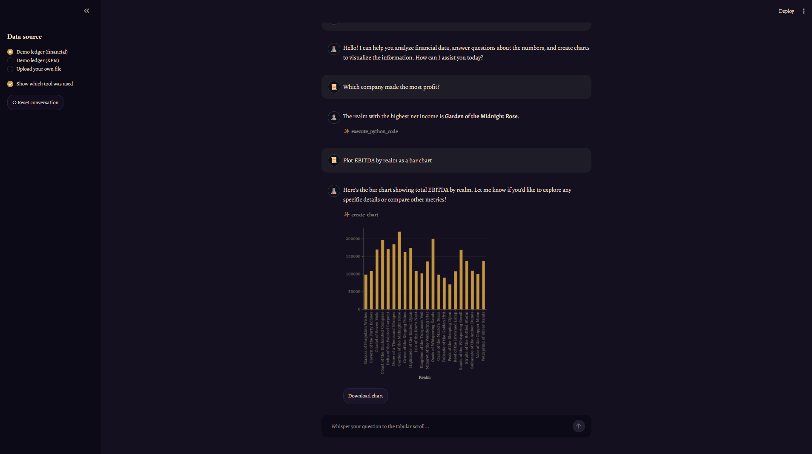

# FinAnalyticsAgent
A personal on-prem AI oracle for spreadsheets: summon a djinn from your local LLM through a LangGraph circle, whisper your question to the tabular scroll, and receive the numbers, insights, and charts hidden within


## Overview
 
An agentic replacement for the OpenAI Assistants-style tabular analytics workflow, rebuilt on **LangGraph** with a **locally hosted LLM** (Qwen3-8B on Apple Silicon via `mlx_lm.server`). The agent accepts natural-language questions over spreadsheet data, decides which tools to call, and returns answers, insights, or charts — all without sending data to third-party APIs.



## Architecture
 
- **Orchestration:** LangGraph (ReAct pattern), built via `create_agent` from `langchain.agents` — not a hand-rolled `StateGraph`
- **LLM:** Qwen3-8B-MLX-4bit (on-prem, OpenAI-compatible endpoint)
- **Data layer:** pandas DataFrame loaded from CSV/XLSX
- **Tooling:** `execute_python_code` for pandas queries; `create_chart` for matplotlib charts
- **UI:** Streamlit chat (`app.py`) — desert-night/lamplight theme via `config.toml`, tool-usage transparency toggle (on by default), chart downloads
- **Model backend (planned):** switchable — local LLM (`mlx_lm.server`) is the primary target, with a future option to swap in Azure OpenAI / OpenAI endpoints
## Tools
 
- `execute_python_code(code: str)` — runs LLM-generated pandas code against the loaded DataFrame, returns the result
- `create_chart(code: str)` — runs LLM-generated matplotlib code against the loaded DataFrame, saves the figure to `outputs/*.png`, returns the file path

## How to Run

```bash
cd FinAnalyticsAgent
source .venv/bin/activate      # or: uv sync
streamlit run app.py
```

Requires a running `mlx_lm.server` endpoint reachable at the address configured
in `finanalyticsagent/graph.py` (or update it to point at your own OpenAI-compatible
local server).

## Roadmap
 
- [x] Repo skeleton and environment setup
- [x] MVP: single agent + one execution tool in Jupyter
- [x] Validate agent against reference questions (from legacy assistant + sample queries) — the generic `execute_python_code` tool + LLM reasoning alone correctly handled all tested questions (single aggregation, per-quarter grouping, growth-over-time, qualitative "why" reasoning, small talk) once `max_tokens` was raised enough for Qwen3's hidden `<think>` reasoning
- [x] Guard `execute_python_code` against printing huge output (e.g. an LLM-generated `print(df)` on a large real-world table) — truncates past a character limit with a clear message instead of flooding the LLM context
- [x] Test user file upload in the notebook — `load_table(path)` generalizes loading beyond one hardcoded file (tested against a second synthetic dataset with an unrelated schema), plus a real click-to-upload flow via `ipywidgets.FileUpload`
- [x] Chart generation tool (`create_chart`) — mirrors `execute_python_code`'s shape (LLM writes plotting code against `df`), saves the figure to `outputs/*.png` (git-ignored, same rationale as `data/`) and returns the path
- [x] Extract code into `.py` modules alongside the notebook — `finanalyticsagent/active_table.py` (current DataFrame), `tools.py`, `prompts.py`, `graph.py` (model+agent construction), `testing.py`. The notebook itself was not touched; it stays as the running R&D log, with a Step 10 proving the modules work standalone
- [x] Streamlit UI (`app.py`) — desert-night/lamplight theme via `config.toml` (no custom CSS), djinn/scroll chat personas, tool-usage transparency (on by default, literal tool names — no roleplay in how the assistant reports its own actions), chart download button, system prompt hardened to never leak implementation details (df/pandas/file paths) to the end user
- [x] `pytest` test suite in `tests/` — pure/deterministic unit tests on `finanalyticsagent/` (schema/preview formatting, `load_table`, the output-truncation guard, the no-chart-drawn error, `active_table`'s `RuntimeError`) plus coarse LLM-in-the-loop regression checks tied to real incidents (small-talk leaks, raw file-path leaks, bold key values, chart transparency); both layers also wired into `r&d.ipynb` as Step 11
- [ ] Multi-file support — agent sees several named tables at once (`dfs['name']`), matching how the legacy Assistants API's Code Interpreter worked (see CLAUDE.md for the full phased plan)
  - [ ] Prototype in `r&d.ipynb` (new steps only) against the real LLM first
  - [ ] Extract into `finanalyticsagent/` (`active_table.py`, `tools.py`, `prompts.py`, `graph.py`), old single-table functions kept as deprecated shims so Step 10 needs no changes
  - [ ] Update/add tests
  - [ ] Update `app.py` (multi-select demo files + multi-file upload)
- [ ] RAG module (Chroma) for non-tabular files (PDF/DOC)
  - [ ] File-type router: tabular files → pandas tools, PDF/DOC → RAG
  - [ ] Router decides by file content and/or extension
  - [ ] Graceful degradation: if the RAG module/embedding endpoint is unavailable, tell the user explicitly ("you uploaded a PDF, RAG is needed, but the module is unavailable") instead of failing silently — important for demos
  - [ ] Embedding model currently only runs locally via Ollama; plan needed for running embedding models within the existing Mac/MLX setup instead
- [x] Conversation memory, in-session — sliding window (sidebar slider, default 3 previous messages), paired with a `request_timeout` on the model so a slow/struggling backend surfaces a UI error instead of hanging forever
- [ ] Conversation memory across sessions (persisted across app restarts) — not done; the in-session version above is a different, smaller thing. Lowest priority, only worth it if the in-session version proves insufficient
- [ ] Model backend switcher — local LLM stays the primary target, but add the
      ability to swap in Azure OpenAI / OpenAI endpoints (or other local
      models like DeepSeek) without rewriting the agent code
- [x] Surface tool-usage transparency to the end user — done as part of the Streamlit UI above
- [ ] *(lowest priority, exploratory)* Dedicated functions/tools for common
      table operations (e.g. groupby-aggregate, filter, growth-over-time) as
      an alternative to the generic `execute_python_code` tool — only worth
      revisiting if we hit a real question the generic tool can't handle;
      so far it has handled everything we've thrown at it
## Stack
 
- Python 3.13, `uv` for env management
- `langgraph`, `langchain`, `langchain-openai`, `pandas`, `matplotlib`, `ipywidgets`, `streamlit`
- Development in WSL2 / VS Code / Jupyter
- On-prem inference: `mlx_lm.server` on Apple Silicon

## Status
 
🚧 Active development. MVP (agent + tools + Streamlit UI) works end-to-end,
backed by a `pytest` test suite; next up is multi-file support and a RAG
module for PDFs.
